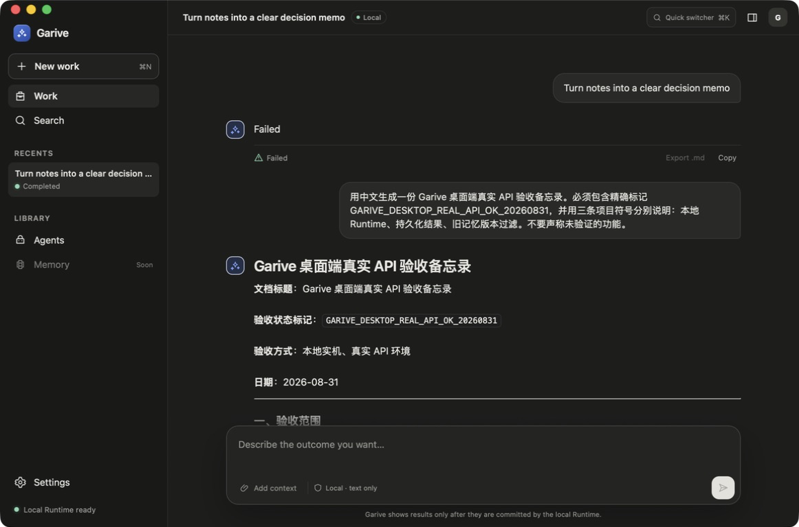

# Desktop real-API Computer Use evidence — 2026-08-31

This is local debug/ad-hoc evidence, not a notarized release admission.

## Environment

- macOS 26.6.1 (25G76), arm64
- Garive debug `.app` built from the active feature worktree
- Model: `deepseek-v4-pro`
- Transport: shipping Anthropic Messages-compatible Runtime transport
- Endpoint: token9 loopback at `127.0.0.1:9527`
- Credential entered in Setup: non-secret `token9-loopback` placeholder

Upstream credentials remained owned by token9 and were not entered into Garive,
captured, printed, or committed.

## Launch defects found and fixed

Computer Use first proved that the generated `Garive.app` exited before opening
a window. Two independent packaging defects were responsible:

1. The package contains both `garive-desktop` and `garive-host`; without an
   explicit Cargo default, Tauri bundled the CLI as the application entrypoint.
   Launching Finder's app therefore printed CLI usage and exited with code 2.
2. After selecting the GUI binary, the updater plugin received a `null`
   configuration and panicked during plugin initialization.

The fixed composition now binds all three layers:

- Cargo `default-run = "garive-desktop"` selects the GUI target;
- Tauri `mainBinaryName = "garive-desktop"` freezes the bundle filename;
- local builds supply an explicit empty updater object, which remains
  fail-closed and exposes no update capability.

The release verifier now checks `CFBundleExecutable`, and a metadata/config
test prevents either invariant from silently regressing.

## Computer Use journey

The unlocked Mac was operated through the accessibility tree and visible
screenshots:

1. First launch rendered the Connect step with native traffic lights, no secret
   value, and disabled Memory labelled `Requires M2-D`.
2. Review showed only preset/profile/model/Agent. The secure credential field
   never exposed its value through accessibility.
3. Commit rendered an explicit Restart required step.
4. Restart loaded Work with `Local Runtime ready`.
5. A Chinese work request was sent from the composer to the real Pro model.
   The running state disabled mutation controls and exposed `Request stop`.
6. The committed result rendered GFM content and the exact marker
   `GARIVE_DESKTOP_REAL_API_OK_20260831`; Copy and Export became available.
7. Garive was quit from its native application menu and opened again. The full
   result, marker, and Completed Recent survived the process restart.

This proves the Desktop Setup → Keychain placeholder → embedded Runtime →
token9 → durable result → restart projection path on this host.

The model's discussion of superseded Memory is not Desktop recall evidence by
itself. That claim is supported separately by the controlled Runtime experiment
in `docs/memory-ledger-live-api-acceptance.md`, which proved the stale revision
was absent before model dispatch. Default Desktop automatic recall remains open.

## Screenshot

- Dimensions: 1162 × 768
- SHA-256: `ec93a017530e3621540e15138506e7014b9ae9755037928fbfe9e817b6944d89`
- Capture class: local debug/ad-hoc candidate
- Edits: format-only JPEG-to-PNG conversion; no crop or content edit
- Redactions: none; no secret is visible

The canonical release manifest keeps M16 pending because this image is not
bound to a notarized candidate package/revision and therefore cannot satisfy
the accepted release evidence gate.

## Observed UX limitation

The task was submitted into an existing Session containing an earlier failed
Turn. Before restart, the rail still showed the prior Needs review state while
the new Turn was Completed; after restart the durable rail projection correctly
showed Completed. The timeline truthfully retained both the earlier failure and
the later completion. A dedicated New Work isolation/refresh acceptance case is
still required before M20/M24 can pass.
