# Garive 移动端用户手册

> 适用范围：Garive iOS 17+ 与 Android 8.0+ 客户端。移动端的核心任务是：
> 在没有携带电脑时，安全地遥控服务端 Agent，查看进度、发起任务、回答问题、审批、取消并确认结果。

## 1. 先理解它是什么

Garive Mobile 是服务端 Agent 的远程控制台，不是在手机上运行 Agent 的迷你 IDE。
Agent、Session、Turn、工具执行和持久化事实都留在服务端 Runtime。手机退出、锁屏或断网时，
已经提交并得到服务端确认的工作仍会继续。

点击左上角菜单可打开与桌面 Work 对齐的 Remote 导航。主画面不常驻底部栏，把空间留给
会话和输入；抽屉中的四个入口分别是：

- **Work**：先处理需要你决定的工作，再看正在运行和最近结束的工作。
- **Sessions**：浏览持久化任务，按状态筛选并重新打开。
- **Agents**：查看服务端已安装的 Agent，并选择合适的 Agent 发起任务。
- **Settings**：查看配对服务、通知状态，或解除本设备配对。

抽屉顶部始终显示当前 Remote Host，下面直接列出最近 Session；因此可以从任意一级页面用一次
菜单操作切换功能，或直接回到最近工作。右上角 **+** 在主画面始终可发起新任务。

移动端不会直接暴露 Runtime 端口。公网访问必须先经过 Garive Gateway；Gateway 只接受
经过授权的移动端路由，Runtime 继续只监听本机 loopback。

## 2. 使用前准备

### 普通用户需要

1. 一台 iPhone/iPad（iOS 17 或更高）或 Android 设备（Android 8.0/API 26 或更高）。
2. 管理员提供的 HTTPS 服务地址，例如 `https://agent.example.com`。
3. 一个尚未使用的一次性配对码，或十分钟内有效的 Garive 配对二维码/链接。
4. 设备时间自动同步；时间明显不准会让短期配对链接失效。

### 服务管理员需要

1. Garive Runtime 仅监听 loopback，例如 `http://127.0.0.1:4317`。
2. 一个可从手机访问的 DNS 名称，以及与该名称匹配的受信任 TLS 证书。
3. Gateway 与 Runtime 部署在同一受控主机或受控 loopback 网络边界。
4. 一次性配对码和至少 20 个字符的管理员令牌，均由密钥管理系统提供。
5. 如需通知：iOS 配置 APNs provider key；Android 配置 FCM service-account 凭据。
6. Runtime Host 的 `max_command_bytes` 至少为 `65536`；移动端把可编辑输入严格限制为
   16 KiB，额外空间用于经过转义的协议字段，避免界面允许而传输层拒绝。

禁止把 Runtime 的明文 HTTP 端口、管理员令牌、APNs 私钥或 FCM service-account 文件放进
移动应用、二维码、命令行历史或仓库。

## 3. 启动服务端

Gateway 使用下列配置：

```text
GARIVE_RUNTIME_ORIGIN=http://127.0.0.1:4317
GARIVE_GATEWAY_LISTEN=:8443
GARIVE_TLS_CERT=/absolute/path/to/fullchain.pem
GARIVE_TLS_KEY=/absolute/path/to/private-key.pem
GARIVE_PAIRING_CODE=<一次性配对码>
GARIVE_ADMIN_TOKEN=<至少 20 个随机字符>
GARIVE_WAKE_POLL_INTERVAL=3s
```

在 `runtime/gateway/` 中运行：

```text
go run ./cmd/garive-gateway
```

公网 DNS 和证书必须与手机填写的服务地址完全匹配。Gateway 进程重启会主动使当前内存中的
设备授权全部失效；这是当前单进程版本的故障关闭策略，用户需要重新配对。

通知是可选增强，不影响前台遥控：

- iOS：设置 `GARIVE_APNS_TEAM_ID`、`GARIVE_APNS_KEY_ID`、
  `GARIVE_APNS_TOPIC`、`GARIVE_APNS_KEY_FILE`；开发签名另设
  `GARIVE_APNS_SANDBOX=true`。
- Android：设置 `GARIVE_FCM_CREDENTIALS`，指向仅存在于 Gateway 主机的
  service-account JSON。

## 4. 安装应用

### Android

在 `mobile/androidApp/` 中，使用 Android SDK 36 构建：

```text
java -classpath ../../experiments/engine-kt/gradle/wrapper/gradle-wrapper.jar \
  org.gradle.wrapper.GradleWrapperMain app:lintRelease app:assembleRelease
```

输出 APK 位于 `app/build/outputs/apk/release/`。正式分发前应使用组织的签名配置生成 APK/AAB。
如启用 FCM，构建时提供四个公开 Firebase Android 标识：
`GARIVE_FIREBASE_APP_ID`、`GARIVE_FIREBASE_API_KEY`、
`GARIVE_FIREBASE_PROJECT_ID`、`GARIVE_FIREBASE_SENDER_ID`。

### iOS

先在 `mobile/shared/` 生成 XCFramework，再在 Xcode 打开
`mobile/iosApp/GariveIOS.xcodeproj`：

```text
java -classpath ../../experiments/engine-kt/gradle/wrapper/gradle-wrapper.jar \
  org.gradle.wrapper.GradleWrapperMain assembleGariveSharedDebugXCFramework
```

在 Xcode 选择组织的 Team、正确的 Bundle ID、APNs entitlement 和目标设备，然后 Archive。
未签名的 Simulator/设备构建只适合开发验证，不能替代 TestFlight/企业分发验收。

## 5. 首次配对

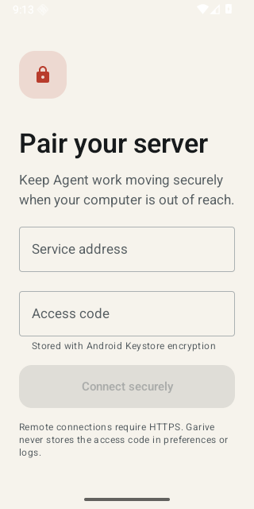

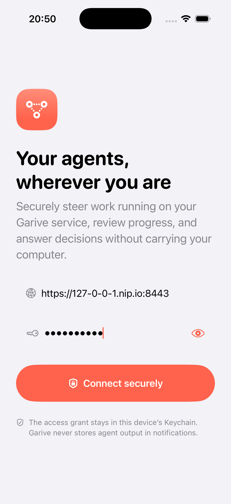

### 手动配对

1. 在 **Service address** 输入管理员给出的完整 HTTPS 根地址。
2. 在 **Access code** 输入一次性配对码。
3. 检查主机名，确认不是 IP、`.local`、`localhost` 或陌生域名。
4. 点击 **Connect securely**。
5. 成功后应用把授权存入 iOS Keychain 或 Android Keystore，不写入偏好、日志或截图。

远程模式拒绝 HTTP、URL 中的用户名/密码、query token、重定向和非根路径。不要为了绕过证书
错误而安装未知根证书或改用明文地址。

### 二维码或链接配对

管理员可生成形如下面的短期链接并编码为二维码：

```text
garive://pair?origin=https%3A%2F%2Fagent.example.com&code=...&exp=...&name=...
```

用系统相机扫描即可交给 Garive 打开，应用本身不需要相机权限。链接必须包含且只包含
`origin`、`code`、`exp`、`name`，并在生成后十分钟内过期。打开后仍应核对服务名称和域名。

一次性配对码成功使用后不能再次使用。如果另一台设备也要连接，管理员必须生成新配对码。

## 6. Work：首页与任务分流

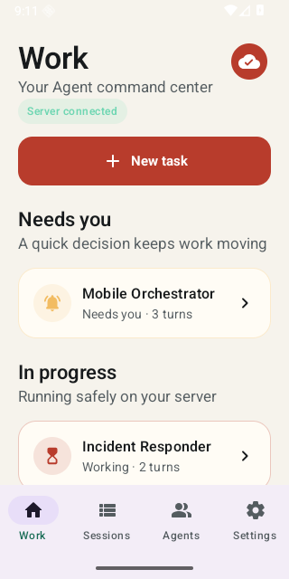

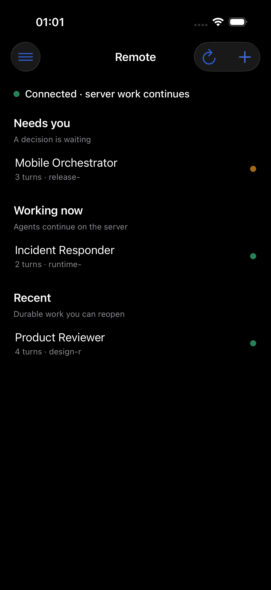

导航、字号和空间层级与桌面 Work 使用同一视觉语言，同时保留原生平台手感。深色使用黑色工作台、
深灰选中态和高对比蓝色操作；浅色使用桌面端暖纸白、低对比边界和同一主蓝色：

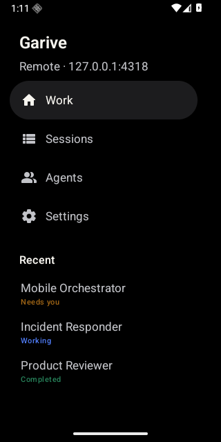

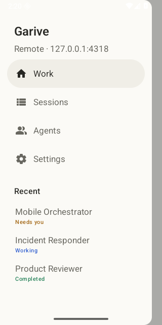

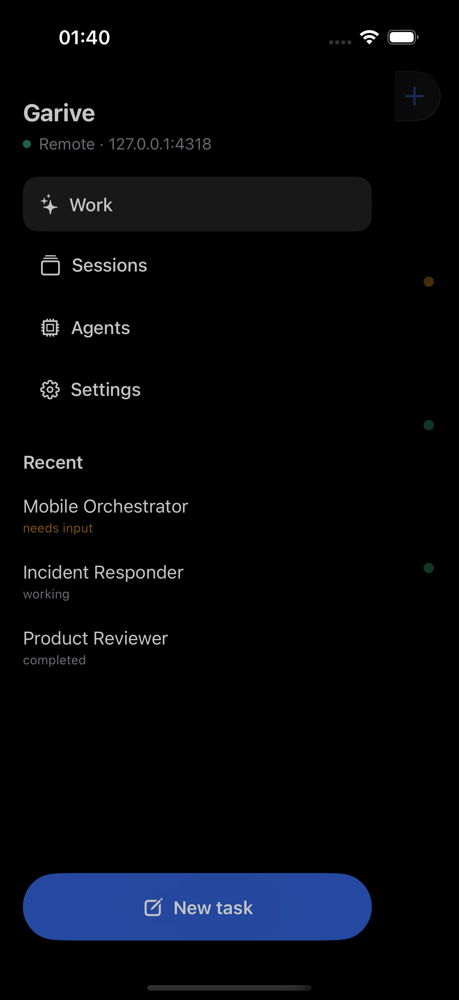

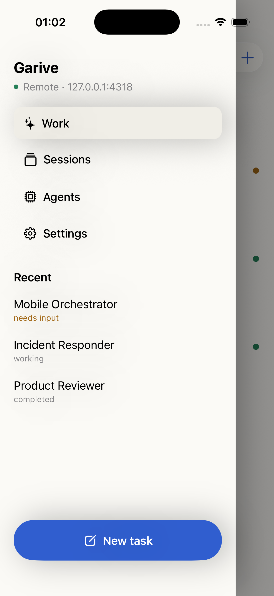

深色模式与超大字体同样保留完整任务身份、状态和可操作目标：

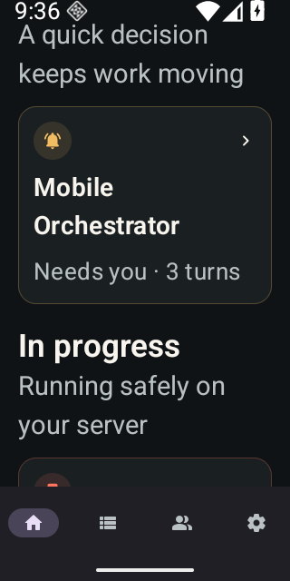

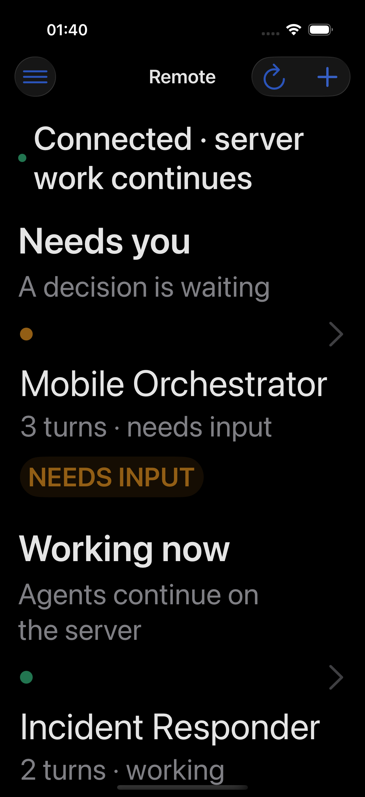

横屏手机会压缩工作区但保留抽屉入口；Android 平板与 iPad 常规宽度使用常驻 Remote 侧栏和
右侧工作区，避免把手机单栏机械拉宽。两种布局保持相同的任务优先级、状态语义和入口：


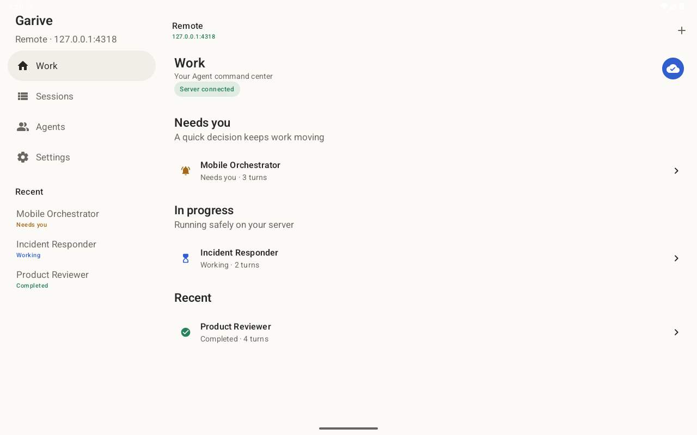

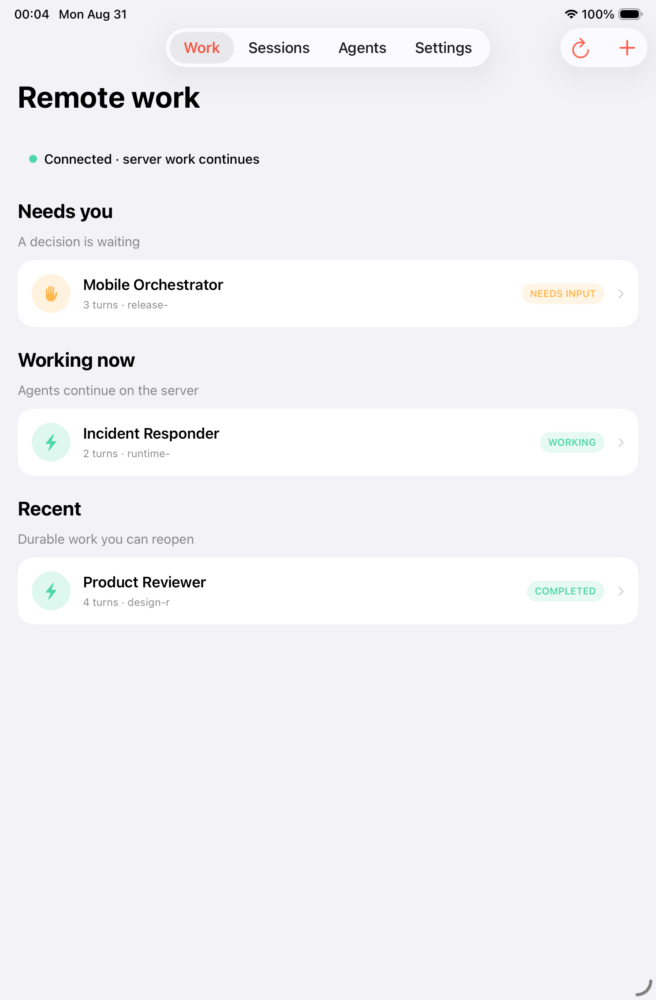

Work 按处理优先级分组：

1. **Needs you**：Agent 正在等待审批或输入，应优先处理。
2. **In progress / Working now**：Agent 正在服务端运行。
3. **Recent**：最近完成、停止或失败的持久化工作，可随时重新打开。

顶部连接状态表示最近一次认证刷新结果，不表示手机正在运行 Agent。点击刷新只重新读取服务端
事实，不会重启任务。普通尺寸使用紧凑文字行和状态点；辅助功能大字体会自动展开为宽松布局。
状态始终同时使用文字和颜色，不能仅凭颜色判断。

## 7. 新建远程任务

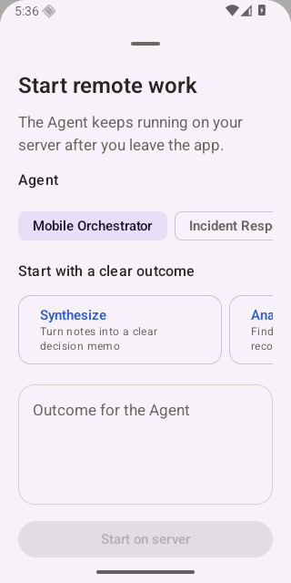

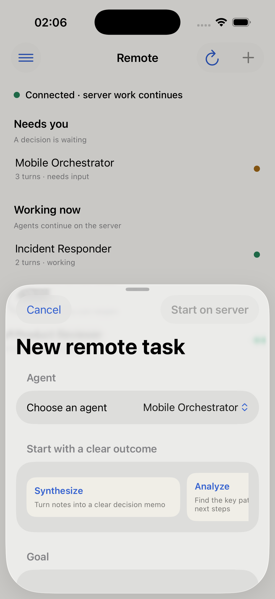

超大字体下，新建任务会改用可滚动/展开布局，所有 Agent、Outcome 和提交控制仍可到达：

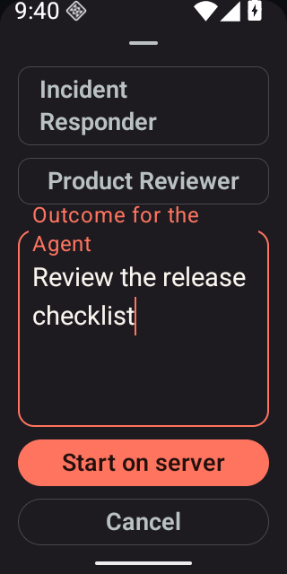

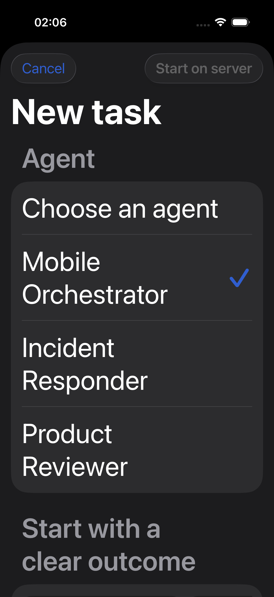

1. 在 Work 点击 **New task**，或从 Agents 选择一个 Agent。
2. 明确核对 Agent 名称；默认选择只是便利，不会改变服务端权限。
3. 可以横向浏览 **Synthesize / Analyze / Create** 快速目标；点击只会把桌面端一致的结果导向文案
   写入可编辑草稿，不会自动提交。
4. 在 **Outcome for the Agent** 补充上下文、验收条件与限制。
5. 点击 **Start on server**。
6. 看到新 Session 和第一条 Turn 的服务端确认后，才表示任务已可靠提交。

创建 Session 与启动第一条 Turn 是两个具有稳定命令身份的操作。若网络在提交期间断开，应用
不会偷偷创建第二个任务，而会把有界 pending record 和精确输入保存在应用私有存储中。即使
应用进程被系统终止，重新打开后仍会先刷新服务端事实，再提供同一 command identity 的
**Retry exact**。

如果用户明确选择 **Forget retry**，应用会再次警告该命令可能已经被服务端接受。确认只会删除
本机的精确重试身份，不会撤销、停止或删除任何服务端工作；原输入仍保留，便于用户先核对历史。

当前移动端输入以文字为主；附件、相机、录音、本地文件和手机端 Runtime 不属于此版本。

## 8. Session、Agent 与会话详情

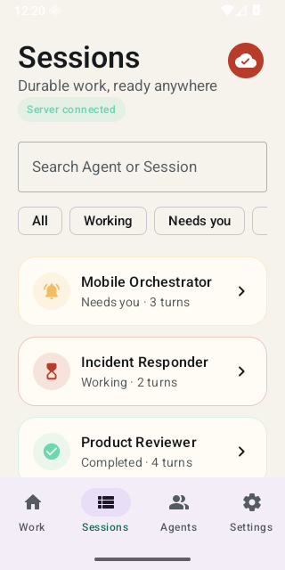

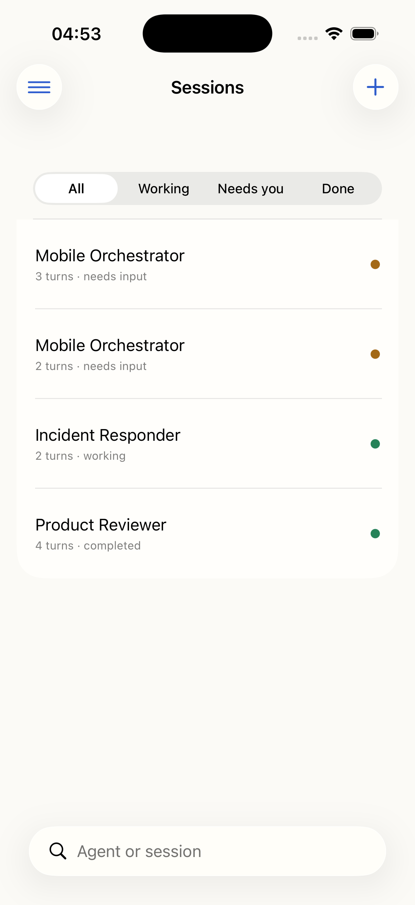

Sessions 提供本地搜索，以及 **All**、**Working**、**Needs you** 和 **Done** 状态筛选。搜索只
匹配当前已加载的公开 Agent 名称和内部 Session 标识，不把查询发送给服务端；内部标识仅作为
协议坐标和本地匹配键，默认列表、无障碍标签和截图均不展示。列表来自服务端持久化投影；重新
打开任务不会复制 Session，也不会丢失已有 Turn。

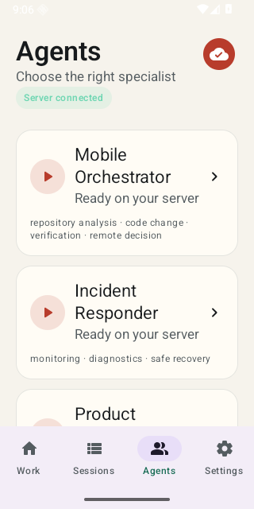

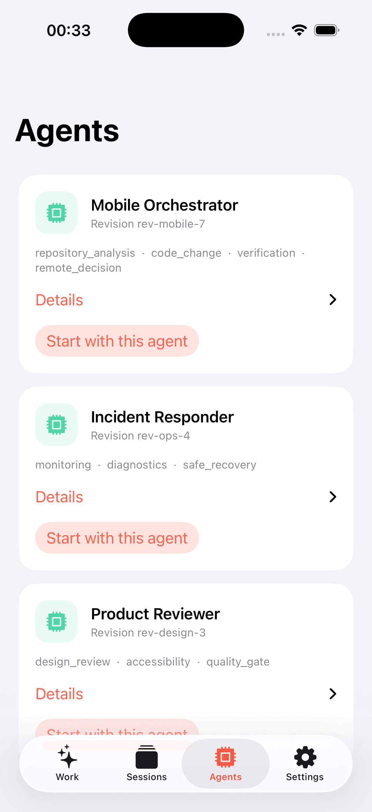

每张卡片的 **Details** 可展开查看并复制精确的 definition ID 和 revision，便于与管理员核对；
日常列表只突出公开名称与能力。离线、授权失效、目标为空或输入超过 16 KiB 时，客户端会保留
编辑内容但禁用远程提交，避免产生明知无法受理的命令。

Agents 展示服务端已安装的 Agent、用途和可用状态。移动端只能选择服务端已经允许的定义，
不能在本地伪造 Agent ID、模型或工具权限。

会话详情依次显示用户输入、服务端公开输出、活动状态和需要用户处理的卡片。长时间运行时可以
离开应用；再次进入会从已确认的持久化位置刷新，而不是把 SSE 断开误判为失败。

当前 Turn 进入终态后，底部输入框可发送新的方向，形成同一 Session 中的新 Turn。运行中的
Execution 不接受绕过协议的即时文本注入。

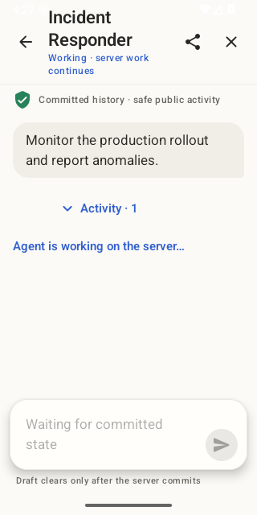

会话右上角的系统分享入口只导出当前界面已经渲染的 **You / Agent** 文本，并由系统分享面板要求
用户明确选择接收方；不会附带授权、服务地址、设备或 Session ID、内部活动坐标及未展示的事件。

## 9. 审批与输入

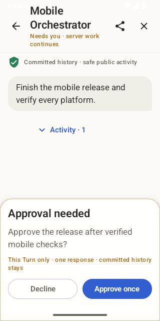

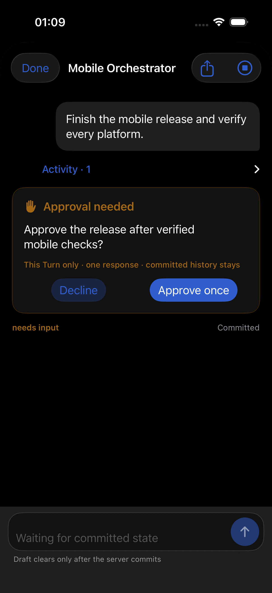

审批卡只在 Runtime 提供了可验证的 suspension 坐标和支持的响应类型时出现：

1. 阅读公开问题和当前活动。
2. 确认这确实是你希望服务端继续的动作。
3. 点击 **Approve once** 只批准当前 Turn 的这一次动作，或点击 **Decline** 明确拒绝。
4. 等待状态变为服务端确认的 `Completed`、继续运行或新的等待状态。

拒绝和批准走同一个带精确 suspension/version/schema 坐标的继续协议，但提交的布尔响应不同；
客户端不把“关闭页面”冒充拒绝。下面是从 Android 原生 UI 点击批准后，由演示 Host 提交并回读的结果：

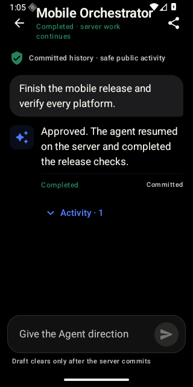

应用不会根据通知文本直接审批。通知只带一次性 opaque route token；打开通知后，应用先向
Gateway 解析目标，再刷新 Runtime 真相，最后才显示可操作卡片。

## 10. 请求取消

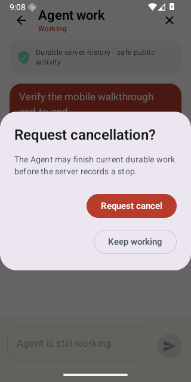

1. 在运行中的会话点击右上角取消图标。
2. 阅读二次确认；取消是“向服务端请求停止”，不是删除历史。
3. 点击 **Request cancel**。
4. 等待服务端提交 `Stopped`。已提交的工作和公开历史仍可查看。

在服务端提交终态前，界面仍可能短暂显示 Working，这是有意的：客户端不能根据一次点击自行
宣布 Agent 已停止。

## 11. 通知、前后台与离线

- 应用退到后台后不会无限维持连接；Agent 继续在服务端运行。
- 回到前台时，应用先取有界快照，再从已确认位置继续跟随事件。
- APNs/FCM 消息只包含分类和十分钟有效的一次性 route token，不包含提示词、输出、路径、
  Session 标题、工具名或凭据。
- 未配置推送时，所有前台功能仍可用；用户需要主动打开应用刷新。
- 网络中断时不要反复点击提交。先等待连接恢复并刷新；对于结果未知的 mutation，只使用界面
  提供的 **Retry exact**。
- `runtime_unavailable` 表示 Gateway 暂时无法连接 loopback Runtime；读取可稍后重试，写操作
  必须保留原命令身份。

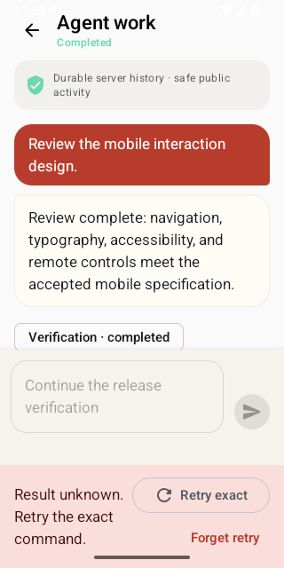

只要仍有结果未知的写操作，**Retry exact** 和 **Forget retry** 就会保持可见，即使后续读取已经
恢复在线。输入框会暂时锁定，避免用户在处理旧命令前发出一个看似相同、身份却不同的新命令。

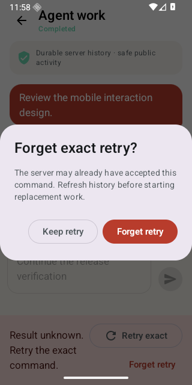

选择 **Forget retry** 前会明确说明服务端可能已经接受原命令。若不确定，选择 **Keep retry**，
先刷新并核对 Session 历史；放弃本地身份不代表撤销服务端工作。

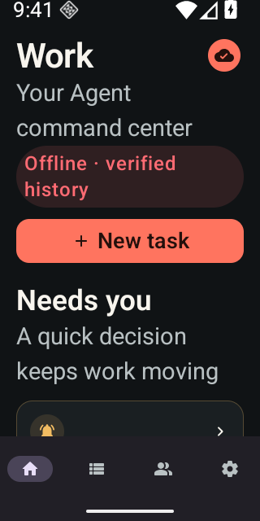

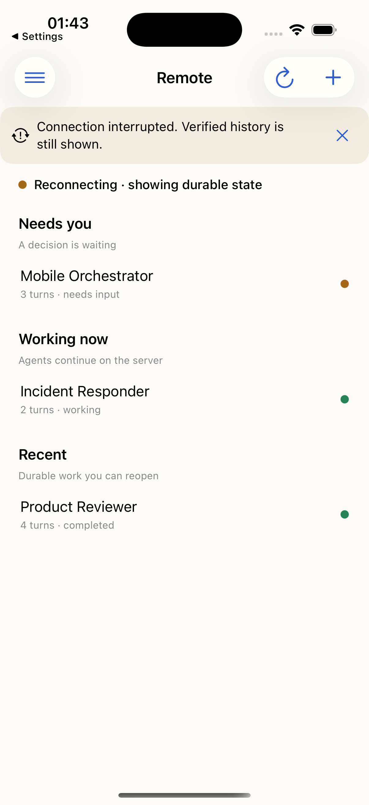

实际离线验证中，停止 Host 后刷新会显示明确的连接中断 banner 和
**Offline · verified history**，并继续保留最后一次已验证的会话投影；banner 可关闭，但关闭只影响
提示，不会修改历史或 pending command。Host 恢复后再次刷新回到 **Server connected**。离线投影
只用于查看，不能把本地状态当作新的服务端事实。

## 12. Settings 与解除配对

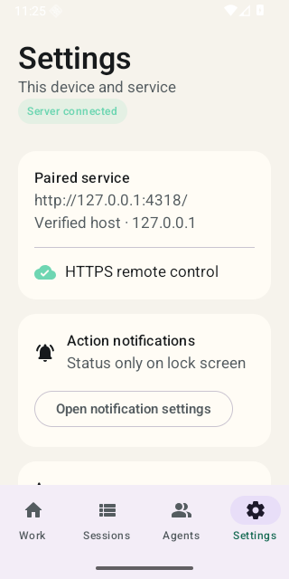

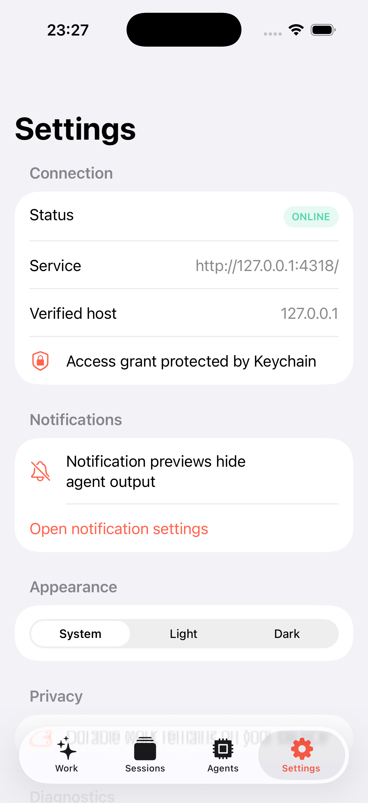

诊断、外观和解除配对控制位于同一可滚动页面的下半部分：

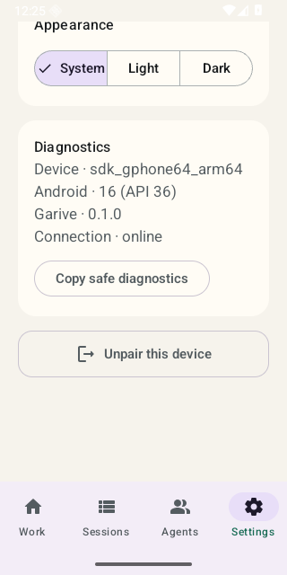

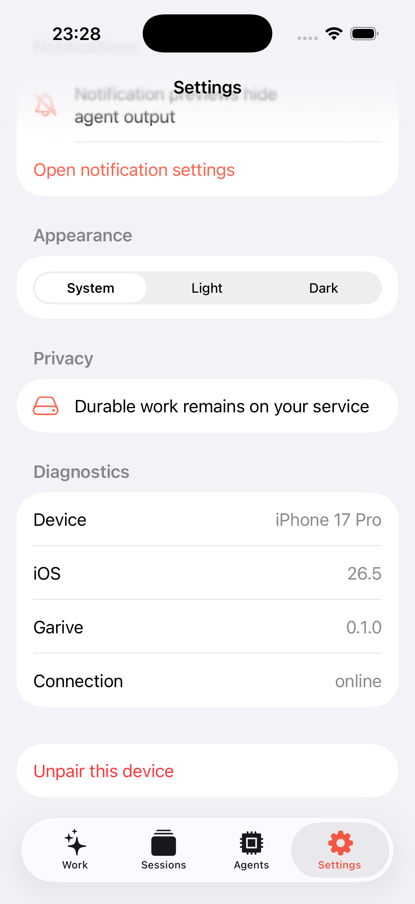

Settings 显示当前配对服务、已验证 host、设备与构建诊断、通知入口和外观主题。主题可选择
**System / Light / Dark**，会在本机持久化；通知按钮进入系统级通知设置，不在应用内伪造授权
状态。**Copy safe diagnostics** 只复制应用版本、系统版本和当前连接状态，并在界面显示复制完成；
不会复制授权、服务地址、Session ID、私有路径、提示词或请求正文。

选择 **Unpair this device** 时：

1. 应用先显示二次确认，并说明服务端工作和历史不会被删除；
2. 确认后，应用先删除本机 Keychain/Keystore 中的授权；
3. 再尽力注销推送并调用自撤销接口；
4. 即使当时离线，本机授权也不会恢复；
5. 下次使用必须重新完成一次性配对。

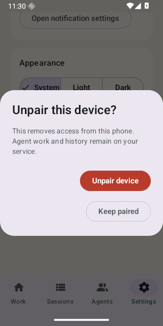

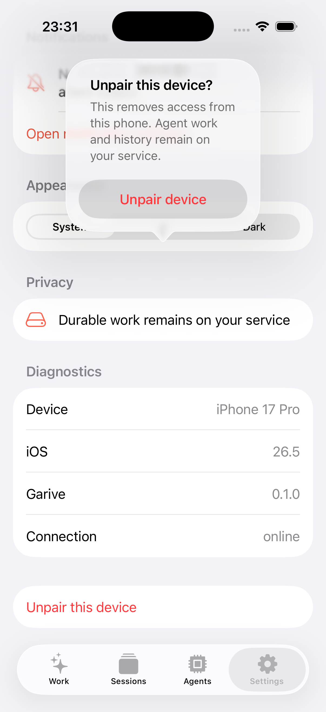

管理员也可使用设备 ID 撤销单台设备。撤销、授权到期或 Gateway 重启后，客户端会收到统一的
`authentication_required` 并要求重新配对。

## 13. 常见问题

| 表现 | 含义与处理 |
|---|---|
| **Connect securely** 不可点 | 服务地址或配对码为空；填写完整 HTTPS 根地址和一次性码。 |
| `pairing_rejected` | 配对码错误、已使用或失效；请管理员生成新码。 |
| 证书错误 | DNS、证书链或有效期不匹配；由管理员修复证书，不要降级到 HTTP。 |
| `authentication_required` | 授权无效、过期、撤销，或 Gateway 已重启；重新配对。 |
| `device_reauth_required` | 设备绑定或账号上下文改变；解除旧配对后重新配对。 |
| `actor_forbidden` | 当前设备无该 Session/安装权限；联系管理员，不要换 ID 猜测。 |
| `rate_limited` | Gateway 未接收该操作；按提示稍后重试。 |
| `runtime_unavailable` | Runtime 未运行或 loopback 路由不可达；管理员检查 Runtime。 |
| `request_too_large` | 输入超过服务端边界；缩短任务目标。 |
| 收不到通知 | 先确认系统通知权限、APNs/FCM 配置和 Gateway 注册；仍可前台刷新。 |
| 点击取消后仍显示 Working | 等待服务端持久化终态并刷新；不要把请求发送成功等同于已停止。 |

排障时可以安全分享稳定错误码、应用版本、系统版本和发生时间。不要分享配对码、授权、管理员
令牌、完整请求/响应正文、私有 Session ID、文件路径或推送 registration ID。

## 14. 可重复功能演示

仓库内置的 walkthrough Host 是真实 HTTP 状态机，只在 Debug 构建使用。它会实际创建 Session、
追加 Turn、提交批准或拒绝、记录取消，并返回多 Turn 持久化时间线；不是静态 UI fixture。

在 `runtime/gateway/` 启动：

```text
go run ./cmd/garive-mobile-demo-host
```

Android Debug APK 安装后，可直接打开首页或确定性的审批 Session：

```text
adb reverse tcp:4318 tcp:4318
adb shell am start -n com.garive.android/.MainActivity --ez garive_walkthrough true
adb shell am start -n com.garive.android/.MainActivity \
  --ez garive_walkthrough true --es garive_walkthrough_session release-approval
```

iOS Simulator 可直接打开首页、导航抽屉或审批 Session：

```text
xcrun simctl launch booted com.garive.mobile --garive-walkthrough
xcrun simctl launch booted com.garive.mobile --garive-walkthrough --garive-walkthrough-sidebar
xcrun simctl launch booted com.garive.mobile --garive-walkthrough --garive-walkthrough-conversation
xcrun simctl launch booted com.garive.mobile --garive-walkthrough --garive-walkthrough-new-task
```

从仓库根目录可用统一门禁重建并核对安装产物；校验器会拒绝缺失、非 PNG、尺寸过小、未被手册
引用的截图，也会核对双端工程、移动 Spec、Debug APK、unsigned Release APK 和 arm64 Simulator App：

```text
just mobile-artifacts
just mobile-android-install
just mobile-ios-install <simulator-udid>
python3 scripts/verify-mobile-evidence.py --artifacts
```

Android 的 Debug APK 可直接安装演示；Release APK 在本地门禁中保持 unsigned，必须由发布方签名后
才能分发。iOS Simulator App 可直接冷安装；物理 iPhone 仍必须使用匹配团队和 entitlement 的签名。

| 演示动作 | UI 入口 | 可观察服务端事实 |
|---|---|---|
| 新建并启动 | `+` → Agent → 快速目标/Outcome → Start | 新 Session 与第一条 running Turn |
| 继续同一 Session | 终态会话底部输入并发送 | 原 Turn 保留，新增 Turn |
| 批准 | Approval needed → Approve once | completion 以 `Approved.` 开头 |
| 拒绝 | Approval needed → Decline | completion 以 `Declined.` 开头 |
| 取消 | 运行会话右上角停止 → Request cancel | Turn 进入 stopped，历史保留 |
| Activity | 点击 `Activity · N` | 默认折叠，可展开公开活动 |
| 重启恢复 | 输入草稿后终止并重开应用 | 导航、Session 草稿与精确 pending 有界恢复 |
| 结果未知 | walkthrough 错误场景 | 只允许 Retry exact 或带警告 Forget retry |

## 15. 截图与验收说明

本手册中的截图来自实际运行的原生 SwiftUI/Compose 应用、共享 KMP 控制器和实时 HTTP Host，
不是设计稿或静态 mock。为了让状态可重复，截图使用了仅在 Debug 构建可启用的 loopback
walkthrough Host；Release 构建无法进入该模式。审批、新建、刷新、取消及状态回读均通过真实
客户端协议执行。深色模式证据同时使用 Android `font_scale=2.0` 和 iOS
`accessibility-extra-large`；空间不足时导航仍通过抽屉向无障碍服务暴露 Work、Sessions、Agents、
Settings 语义标签；Android 平板与 iPad 常规宽度则使用常驻侧栏和独立工作区。

已经自动或本地验证：Gateway route/auth/race 测试、KMP JVM 测试、Android lint/APK/API 36
界面流程（14 条，含整应用 Work → Sessions → 新任务及 Light → Dark 切换）、Swift 测试（9 条）、
iOS Simulator XCUITest（4 条，含 Light → Dark → System 切换）与构建，以及断开/恢复 Host 的
离线历史回退。原生安全存储测试还验证了授权不会明文进入偏好，解除配对后授权不可再加载，且
本机设备身份密钥会轮换。共享重启测试验证了未知 start 在新控制器实例中恢复相同 identity、
输入和 Retry exact，并对所有 pending 形状执行摘要往返及篡改拒绝。当前手册包含 36 张实际运行截图。
正式远程发布仍必须在受信任公网 TLS、
真实 APNs/FCM 凭据和物理 iOS/Android 设备上完成 create、reconnect、background/wake、
decision、cancel、terminal、unpair/revoke 全链路验收；在这些外部条件完成前，不应把本地截图
当作生产网络发布证明。

协议与安全细节见：

- [`../../spec/design/mobile-remote-work-client.md`](../../spec/design/mobile-remote-work-client.md)
- [`../../spec/design/mobile-gateway-v1.md`](../../spec/design/mobile-gateway-v1.md)
- [`../architecture/mobile-remote-work.md`](../architecture/mobile-remote-work.md)
